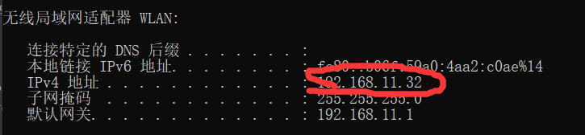
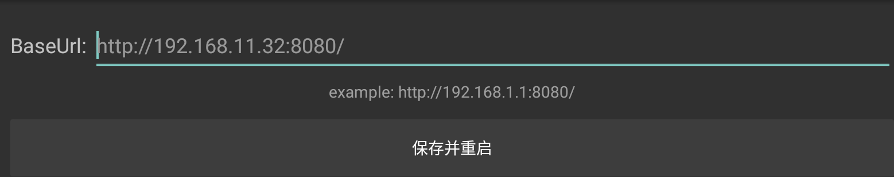
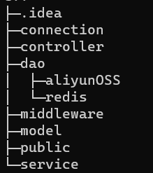

# simple-demo

## 抖音项目服务端简单示例

### 准备
1、安装夜神模拟器

2、在wifi环境下，打开cmd，输入ipconfig，输入自己的局域网端口

下载抖声安装包

双击我的，连接

3、安装ffmpeg

配置系统环境变量path如:C:\Users\86187\Downloads\ffmpeg-master-latest-win64-gpl-shared.zip\ffmpeg-master-latest-win64-gpl-shared\bin

4、改mysql登录name和password，创建douyin数据库

5、需要有redis环境（127.0.0.1:6379）

6、阿里云OSS,在aliyunOSS改动accessKEY和bucketname等

### 项目结构

### 功能说明
controller/user.go:提供用户的注册和登录功能

controller/relation :提供用户之前点赞和取消点赞，并展示点赞列表

controller/publish :提供用户上传视频功能并展示作品列表

controller/feed : 提供视频feed流

controller/favorite :视频点赞和取消点赞，并展示点赞列表

controller/comment : 评论和取消评论，展示评论列表

